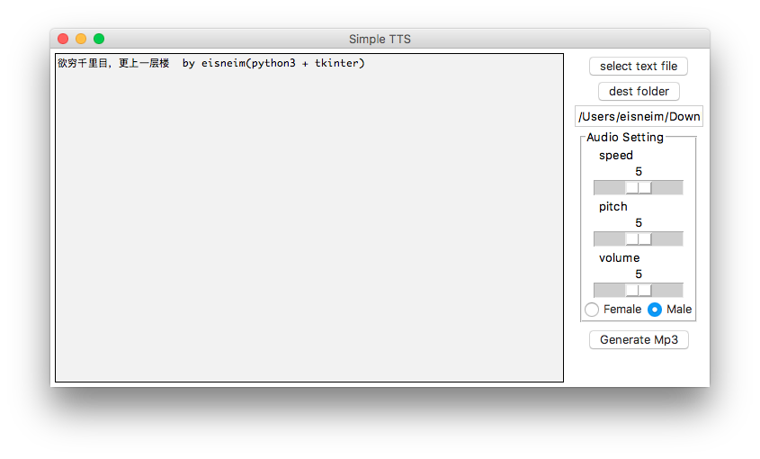

cytron_tts_gui
=========
simple text to speech client GUI using Baidu's tts API, currently only supports chinese language

this simple app is writen in Python3 with tkinter 8.5

### TODO
 - other tts backen
 - more audio format option

dowload latest [release](https://github.com/eisneim/cytron_tts_gui/releases)

example app key & secret:

 - key: GgkayLHpMFWX5PmLny7V3MYR
 - secret: QBgHvANyHnKEerG4KqCADCjs8sQWACoG
 - key2: oDjb5r5XVpW04Gopd374muGK
 - secret2: 53A9ufobHzijbaRhI5QTidXUu5v788rO
if those key&secret pair won't work, you can register one here: http://yuyin.baidu.com/
